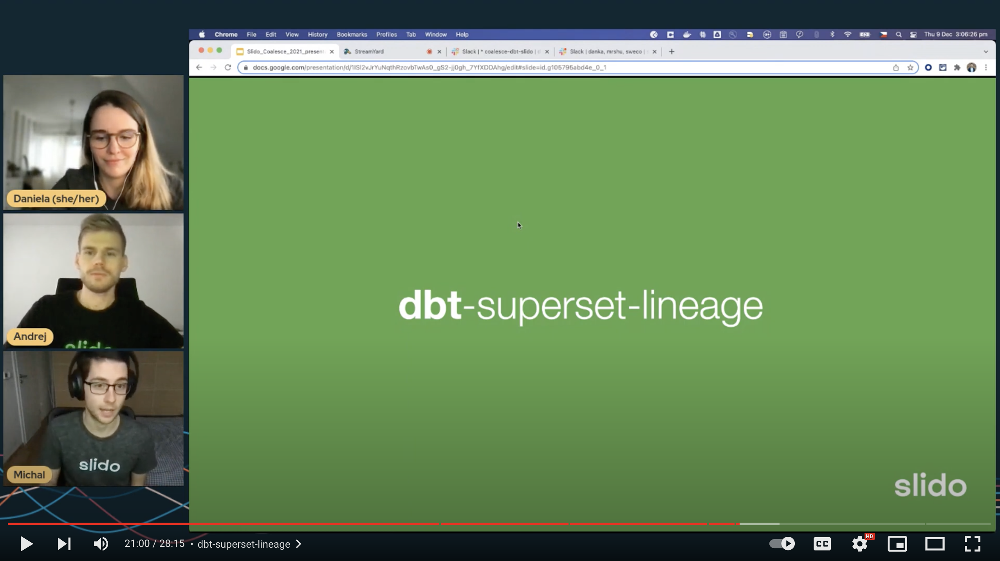
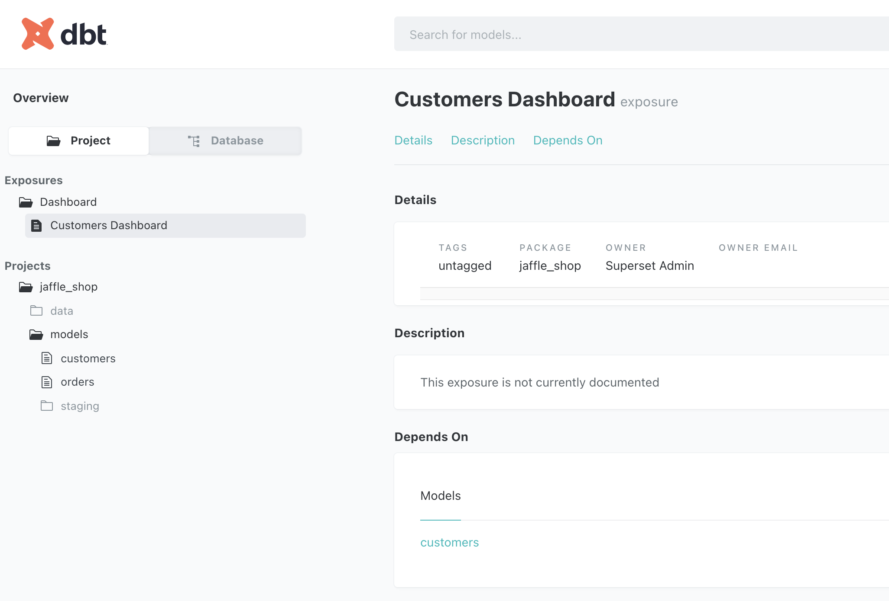
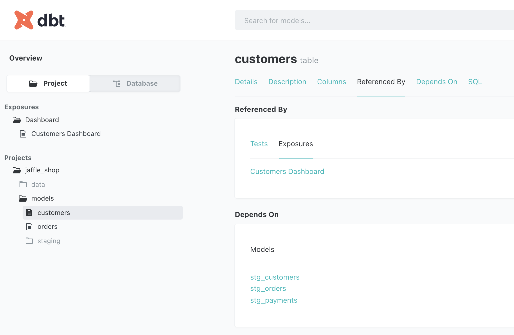
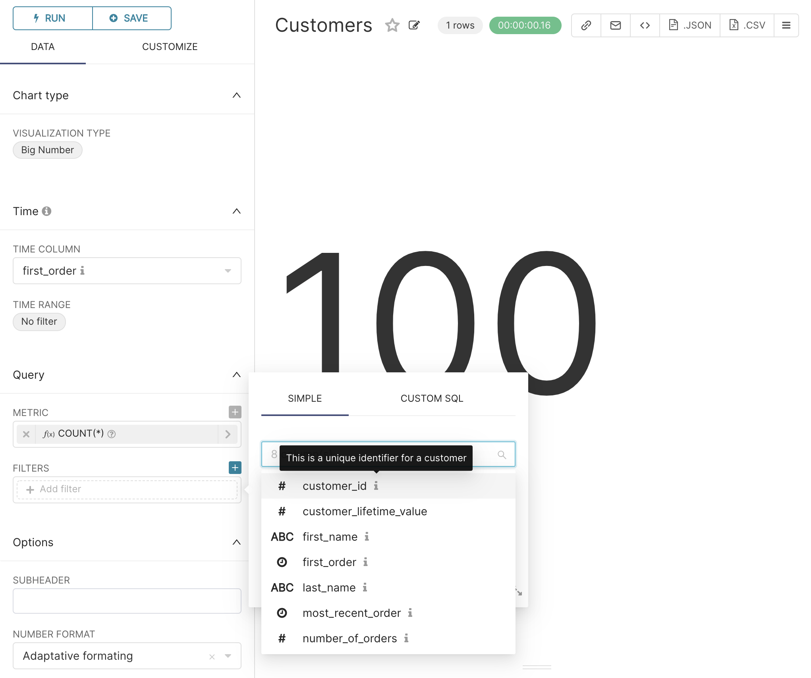

# dbt-superset-lineage

<a href="https://github.com/slidoapp/dbt-superset-lineage/blob/main/LICENSE.md"></a>
<a href="https://pypi.org/project/dbt-coverage/"></a>


_Make [dbt](https://github.com/dbt-labs/dbt) docs and [Apache Superset](https://github.com/apache/superset) talk to one another_

## Why do I need something like this?
Odds are rather high that you use dbt together with a visualisation tool. If so, these questions might have popped
into your head time to time:
- "Could I get rid of this model? Does it get used for some dashboards? And in which ones, if yes?"
- "It would be so handy to see all these well-maintained model and column descriptions when exploring and creating charts."

In case your visualisation tool of choice is Supserset, you are in luck!

Using `dbt-superset-lineage`, you can:
- Add dependencies of Superset dashboards to your dbt sources and models
- Sync model and column descriptions from dbt docs to Superset

This will help you:
- Avoid broken dashboards because of deprecated or changed models
- Choosing the right attributes without navigating back and forth between chart and documentation

## Demo
The package was presented during [Coalesce](https://coalesce.getdbt.com/), the annual dbt conference, as a part of the talk
[_From 100 spreadsheets to 100 data analysts: the story of dbt at Slido_](https://www.getdbt.com/coalesce-2021/from-spreadsheets-to-data-analysts-the-story-of-dbt-at-slido/).
Watch a demo in the video below.

[](https://youtu.be/YA0yqYSs9BQ?t=1240)

## Installation

```
pip install dbt-superset-lineage
```

## Usage
`dbt-superset-lineage` comes with two basic commands: `pull-dashboards` and `push-descriptions`.
The documentation for the individual commands can be shown by using the `--help` option.

It includes a wrapper for [Superset API](https://superset.apache.org/docs/rest-api), one only needs to provide
`SUPERSET_ACCESS_TOKEN`/`SUPERSET_REFRESH_TOKEN` (obtained via `/security/login`)
as environment variable or through `--superset-access-token`/`superset-refresh-token` option.

**N.B.**
- Make sure to run `dbt compile` (or `dbt run`) against the production profile, not your development profile  
- In case more databases are used within dbt and/or Superset and there are duplicate names (`schema + table`) across
  them, specify the database through `--dbt-db-name` and/or `--superset-db-id` options
- Currently, `PUT` requests are only supported if CSRF tokens are disabled in Superset (`WTF_CSRF_ENABLED=False`).
- Tested on dbt v1.4.5 and Apache Superset v2.0.1. Other versions might face errors due to different underlying code and API.

### Pull dashboards
Pull dashboards from Superset and add them as
[exposures](https://docs.getdbt.com/docs/building-a-dbt-project/exposures/) to dbt docs with
references to dbt sources and models, making them visible both separately and as dependencies.

**N.B.**
- Only published dashboards are extracted.

```console
$ cd jaffle_shop
$ dbt compile  # Compile project to create manifest.json
$ export SUPERSET_ACCESS_TOKEN=<TOKEN>
$ dbt-superset-lineage pull-dashboards https://mysuperset.mycompany.com  # Pull dashboards from Superset to /models/exposures/superset_dashboards.yml
$ dbt docs generate # Generate dbt docs
$ dbt docs serve # Serve dbt docs
```





### Push descriptions
Push model and column descriptions from your dbt docs to Superset as plain text so that they could be viewed
in Superset when creating charts.

**N.B.**:
- Run carefully as this rewrites your datasets using merged metadata from Superset and dbt docs.
- Descriptions are rendered as plain text, hence no markdown syntax, incl. links, will be displayed.
- Avoid special characters and strings in your dbt docs, e.g. `→` or `<null>`.

```console
$ cd jaffle_shop
$ dbt compile  # Compile project to create manifest.json
$ export SUPERSET_ACCESS_TOKEN=<TOKEN>
$ dbt-superset-lineage push-descriptions https://mysuperset.mycompany.com  # Push descrptions from dbt docs to Superset
```


## License
Licensed under the MIT license (see [LICENSE.md](LICENSE.md) file for more details).
